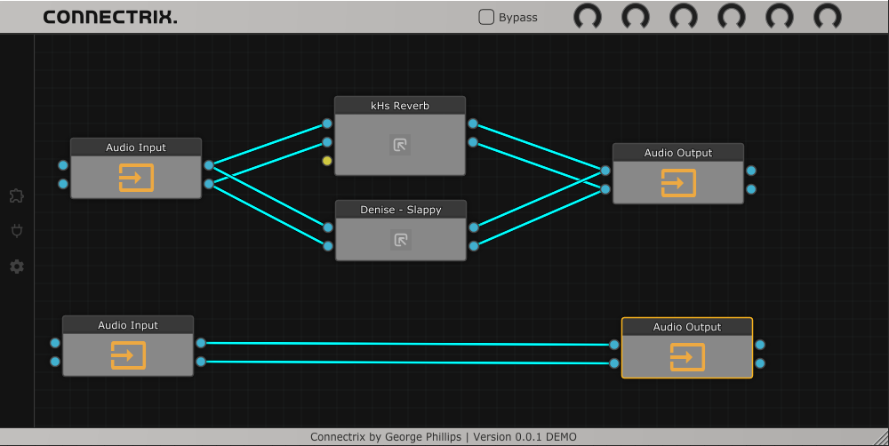

---

<h1>
    Open Source VST3 node graph plugin.
    
        
        
        
    
</h1>

<h1>Licence - GPL3</h1>

   Connectrix is a VST3 node graph builder built with JUCE, scan your system for VST3 plugins and use them to created custom audio processor graphs.

    Connectrix started as a university project but is now being open sourced under the GPL-3 licence.
    The GPL-3 licence only covers the code found in this repository, the steinburg SDK and the JUCE framwork have their own licences that you will need to abide by.

